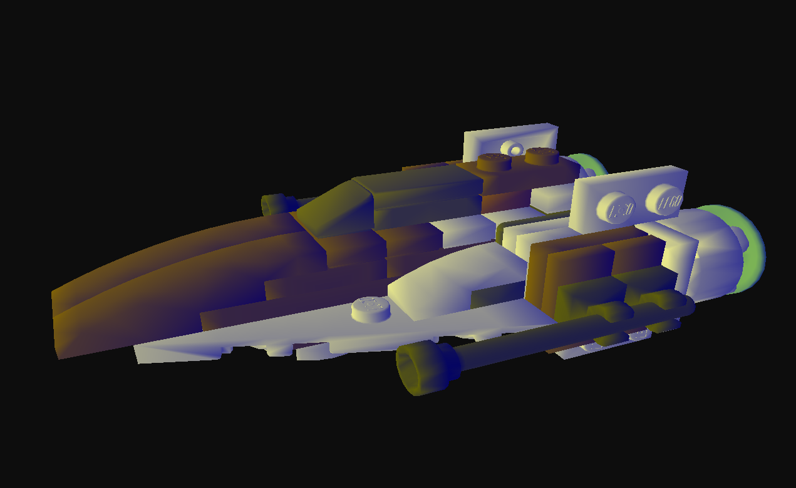

# Computer Graphics Gooch Shading Demo

Compiled for Windows on Visual Studio 17.

## What is this?

This is a rendering engine that can render .obj models in various ways. The primary method is non-photorealistic rendering as described in [this paper](https://www.cs.princeton.edu/courses/archive/fall00/cs597b/papers/gooch98.pdf), more commonly known as gooch shading. The primary option is warm/cool shading as described in the paper, but we also implemented other shaders that render the object by z-depth, as well as a shader that does kernel-based edge detection. All modes can be toggled between using various keybinds as described on the control screen (pressing E).

For more specific implementation information, please view the explanation report.

## How to use

The folder labeled 'final executable' contains the final executable compiled for windows, along with all required assets.
Once loaded, use wasd to move around, mouse to look around.

Press E to list all controls.

## License
>The MIT License (MIT)

>Copyright (c) 2015 Kevin Fung

>Permission is hereby granted, free of charge, to any person obtaining a copy of this software and associated documentation files (the "Software"), to deal in the Software without restriction, including without limitation the rights to use, copy, modify, merge, publish, distribute, sublicense, and/or sell copies of the Software, and to permit persons to whom the Software is furnished to do so, subject to the following conditions:

>The above copyright notice and this permission notice shall be included in all copies or substantial portions of the Software.

>THE SOFTWARE IS PROVIDED "AS IS", WITHOUT WARRANTY OF ANY KIND, EXPRESS OR IMPLIED, INCLUDING BUT NOT LIMITED TO THE WARRANTIES OF MERCHANTABILITY, FITNESS FOR A PARTICULAR PURPOSE AND NONINFRINGEMENT. IN NO EVENT SHALL THE AUTHORS OR COPYRIGHT HOLDERS BE LIABLE FOR ANY CLAIM, DAMAGES OR OTHER LIABILITY, WHETHER IN AN ACTION OF CONTRACT, TORT OR OTHERWISE, ARISING FROM, OUT OF OR IN CONNECTION WITH THE SOFTWARE OR THE USE OR OTHER DEALINGS IN THE SOFTWARE.
